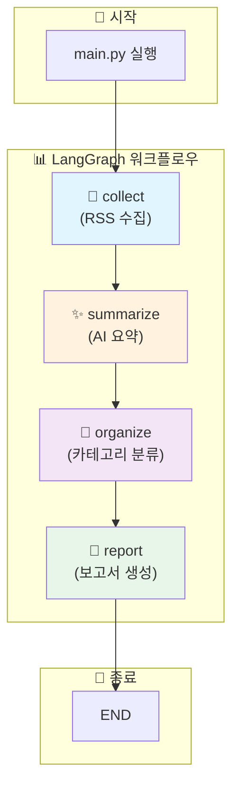
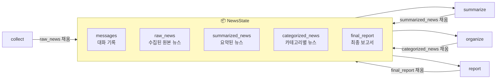
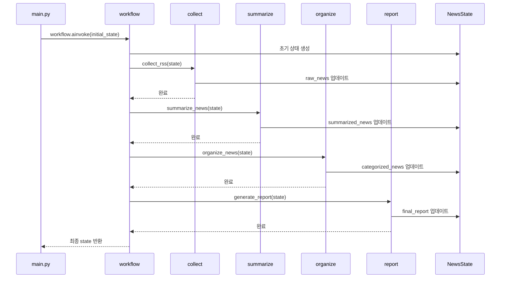
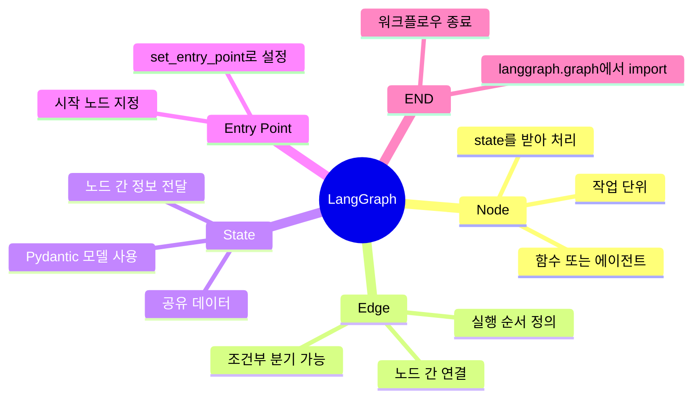

# 🗞️ Google News Multi-Agent (LangGraph)

> LangGraph를 활용한 Google 뉴스 수집 및 AI 요약 시스템

이 프로젝트는 **LangGraph**를 사용하여 Google News RSS 피드에서 뉴스를 수집하고, AI로 요약한 뒤, 카테고리별로 분류하여 최종 보고서를 생성하는 **멀티 에이전트 시스템**입니다.

---

## 📖 LangGraph란?

**LangGraph**는 LLM(Large Language Model) 기반 애플리케이션을 **그래프 형태의 워크플로우**로 구성할 수 있게 해주는 프레임워크입니다.

### 핵심 개념 3가지

| 개념 | 설명 | 이 프로젝트에서 |
|------|------|----------------|
| **Node (노드)** | 작업을 수행하는 단위 | 각 에이전트 (`collect`, `summarize`, `organize`, `report`) |
| **Edge (엣지)** | 노드 간의 연결 (실행 순서) | `collect → summarize → organize → report → END` |
| **State (상태)** | 노드 간에 공유되는 데이터 | `NewsState` 클래스 (뉴스 데이터, 요약, 카테고리 등) |

---

## 🔄 워크플로우 시각화

이 프로젝트의 에이전트는 아래와 같은 순서로 실행됩니다:



### 각 단계별 설명

| 순서 | 노드 | 에이전트 | 역할 |
|:---:|------|----------|------|
| 1️⃣ | `collect` | `RSSCollectorAgent` | Google News RSS에서 뉴스 수집 |
| 2️⃣ | `summarize` | `NewsSummarizerAgent` | AI(Groq LLM)로 뉴스 내용 2-3문장 요약 |
| 3️⃣ | `organize` | `NewsOrganizerAgent` | 정치/경제/사회/생활/스포츠/연예로 분류 |
| 4️⃣ | `report` | `ReportGeneratorAgent` | 마크다운 형식의 최종 보고서 생성 |

---

## 🏗️ 프로젝트 구조

```
ch9_goolge_news_multiagent/
├── 📄 main.py           # 프로그램 진입점 (실행 파일)
├── 📄 workflow.py       # ⭐ LangGraph 워크플로우 정의
├── 📄 state.py          # ⭐ 공유 상태(State) 정의
├── 📄 config.py         # 설정 관리 (API 키, 모델명 등)
├── 📄 utils.py          # 유틸리티 함수
├── 📁 agents/           # 에이전트 모듈
│   ├── __init__.py
│   ├── collector.py     # RSS 수집 에이전트
│   ├── summarizer.py    # AI 요약 에이전트
│   ├── organizer.py     # 카테고리 분류 에이전트
│   └── reporter.py      # 보고서 생성 에이전트
└── 📁 outputs/          # 생성된 보고서 저장 폴더
```

---

## 🧠 State (상태) 이해하기

**State**는 모든 노드(에이전트)가 공유하는 데이터입니다.  
각 노드는 State를 받아서 작업을 수행한 후, 업데이트된 State를 다음 노드에 전달합니다.



### State의 각 필드

```python
class NewsState(BaseModel):
    messages: list[BaseMessage] = []       # 대화 히스토리
    raw_news: list[dict] = []              # 수집된 원본 뉴스
    summarized_news: list[dict] = []       # AI가 요약한 뉴스
    categorized_news: dict[str, list] = {} # 카테고리별 분류된 뉴스
    final_report: str = ""                 # 최종 마크다운 보고서
    error_log: list[str] = []              # 에러 기록
```

---

## ⚙️ 워크플로우 코드 분석

`workflow.py` 파일이 LangGraph의 핵심입니다:

```python
from langgraph.graph import StateGraph, END

def create_news_workflow(llm):
    # 1️⃣ 에이전트 인스턴스 생성
    collector = RSSCollectorAgent()
    summarizer = NewsSummarizerAgent(llm)
    organizer = NewsOrganizerAgent(llm)
    reporter = ReportGeneratorAgent(llm)

    # 2️⃣ StateGraph 생성 (State 클래스 전달)
    workflow = StateGraph(NewsState)

    # 3️⃣ 노드 추가 (이름, 실행할 함수)
    workflow.add_node("collect", collector.collect_rss)
    workflow.add_node("summarize", summarizer.summarize_news)
    workflow.add_node("organize", organizer.organize_news)
    workflow.add_node("report", reporter.generate_report)

    # 4️⃣ 시작점 설정
    workflow.set_entry_point("collect")

    # 5️⃣ 엣지 추가 (노드 간 연결)
    workflow.add_edge("collect", "summarize")
    workflow.add_edge("summarize", "organize")
    workflow.add_edge("organize", "report")
    workflow.add_edge("report", END)  # END = 워크플로우 종료

    # 6️⃣ 컴파일 후 반환
    return workflow.compile()
```

### 코드 흐름도



---

## 🚀 실행 방법

### 1. 환경 변수 설정

`.env` 파일을 생성하고 Groq API 키를 설정합니다:

```env
GROQ_API_KEY=your_groq_api_key_here
```

### 2. 의존성 설치

```bash
pip install langchain-groq langgraph feedparser trafilatura httpx beautifulsoup4 pydantic python-dotenv
```

### 3. 실행

```bash
python main.py
```

### 4. 결과 확인

`outputs/` 폴더에 마크다운 형식의 뉴스 보고서가 생성됩니다.

---

## 💡 LangGraph 핵심 개념 정리



---

## 📚 더 알아보기

- [LangGraph 공식 문서](https://langchain-ai.github.io/langgraph/)
- [LangChain 공식 문서](https://python.langchain.com/)
- [Groq API](https://console.groq.com/)

---

## 🎯 요약

이 프로젝트에서 LangGraph는 다음과 같이 사용됩니다:

1. **`StateGraph(NewsState)`** - 상태를 기반으로 그래프 생성
2. **`add_node("이름", 함수)`** - 각 에이전트를 노드로 등록
3. **`add_edge("A", "B")`** - A 완료 후 B 실행하도록 연결
4. **`set_entry_point("이름")`** - 시작 노드 지정
5. **`compile()`** - 실행 가능한 워크플로우로 컴파일
6. **`ainvoke(state)`** - 비동기로 워크플로우 실행

이 패턴만 이해하면 LangGraph의 기본을 마스터한 것입니다! 🎉
